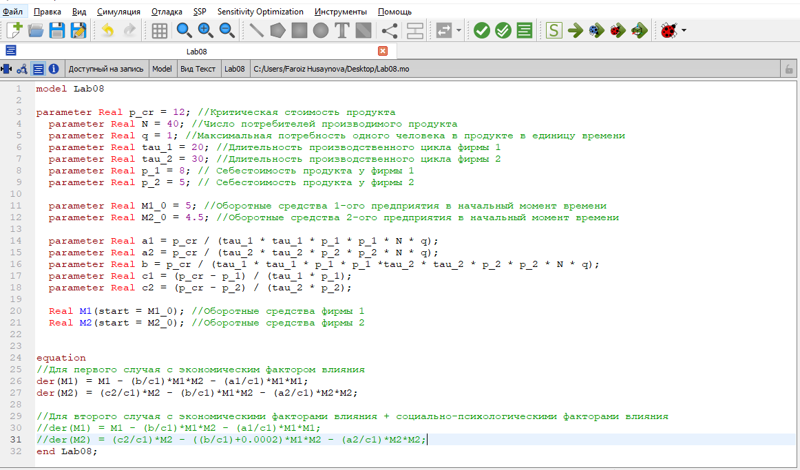
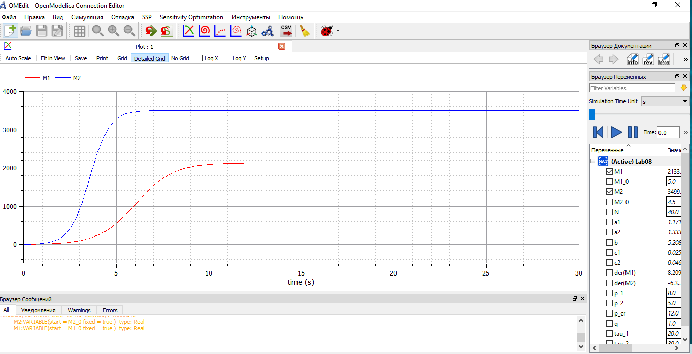
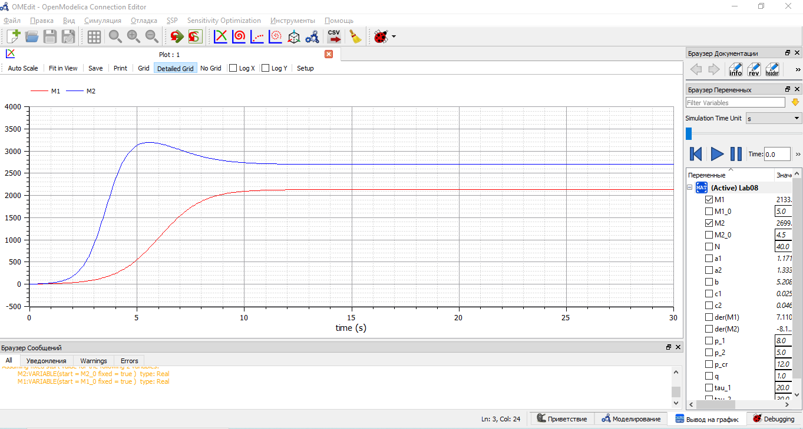

---
# Front matter
lang: ru-RU
title: "Лабораторная работа №8 по математическому моделированию"
subtitle: "Модель конкуренции двух фирм"
author: "Хусайнова Фароиз Дилшодовна"

# Formatting
toc-title: "Содержание"
toc: true # Table of contents
toc_depth: 2
lof: true # List of figures
lot: true # List of tables
fontsize: 12pt
linestretch: 1.5
papersize: a4paper
documentclass: scrreprt
polyglossia-lang: russian
polyglossia-otherlangs: english
mainfont: PT Serif
romanfont: PT Serif
sansfont: PT Sans
monofont: PT Mono
mainfontoptions: Ligatures=TeX
romanfontoptions: Ligatures=TeX
sansfontoptions: Ligatures=TeX,Scale=MatchLowercase
monofontoptions: Scale=MatchLowercase
indent: true
pdf-engine: lualatex
header-includes:
  - \linepenalty=10 # the penalty added to the badness of each line within a paragraph (no associated penalty node) Increasing the value makes tex try to have fewer lines in the paragraph.
  - \interlinepenalty=0 # value of the penalty (node) added after each line of a paragraph.
  - \hyphenpenalty=50 # the penalty for line breaking at an automatically inserted hyphen
  - \exhyphenpenalty=50 # the penalty for line breaking at an explicit hyphen
  - \binoppenalty=700 # the penalty for breaking a line at a binary operator
  - \relpenalty=500 # the penalty for breaking a line at a relation
  - \clubpenalty=150 # extra penalty for breaking after first line of a paragraph
  - \widowpenalty=150 # extra penalty for breaking before last line of a paragraph
  - \displaywidowpenalty=50 # extra penalty for breaking before last line before a display math
  - \brokenpenalty=100 # extra penalty for page breaking after a hyphenated line
  - \predisplaypenalty=10000 # penalty for breaking before a display
  - \postdisplaypenalty=0 # penalty for breaking after a display
  - \floatingpenalty = 20000 # penalty for splitting an insertion (can only be split footnote in standard LaTeX)
  - \raggedbottom # or \flushbottom
  - \usepackage{float} # keep figures where there are in the text
  - \floatplacement{figure}{H} # keep figures where there are in the text
---

# Цель работы

Ознакомиться с моделью конкуренции двух фирм и построить их с помощью языка программирования Modelica.

# Задание

1. Построить графики изменения оборотных средств фирмы 1 и фирмы 2 без учета постоянных издержек и с веденной нормировкой для случая 1.
2. Построить графики изменения оборотных средств фирмы 1 и фирмы 2 без учета постоянных издержек и с веденной нормировкой для случая 2.

# Теоретическое введение

Модель конкуренции двух фирм для случая, когда нет социально-психологического фактора имеет следующий вид:

$$ \frac{dM_1}{d\theta} = M_1 - \frac{b}{c_1} M_1 M_2 - \frac{a_1}{c_1} M_1^2 $$

$$ \frac{dM_2}{d\theta} = \frac{c_2}{c_1} M_2 - \frac{b}{c_1} M_1 M_2-\frac{a_2}{c_1} M_2^2 $$

где $$ a_1 = \frac{p_{cr}}{{\tau}1^2 p_1^2 N q }, a_2 = \frac{p{cr}}{{\tau}2^2 p_2^2 N q}, b = \frac{p{cr}}{{\tau}_1^2 p_1^2 {\tau}2^2 p_2^2 N q } $$ $$ c_1 = \frac{p{cr} - p_1}{{\tau}1 p_1}, c_2 = \frac{p{cr} - p_2}{{\tau}_2 p_2}$$

N - число потребителей производимого продукта
  
$\tau$ - длительность производственного цикла  

p~cr~ - критическая стоимость продукта 
 
p - себестоимость продукта  

q - максимальная потребность одного человека в продукте в единицу времени  

$\theta=\frac{t}{c_1}$ - безразмерное время.

Для случая когда мы учитываем социально-психологический фактор система принимает следующий вид:

$$ \frac{dM_1}{d\theta} = M_1 - \frac{b}{c_1} M_1 M_2-\frac{a_1}{c_1} M_1^2 $$

$$ \frac{dM_2}{d\theta} = \frac{c_2}{c_1} M_2 - (\frac{b}{c_1} + 0.0002) M_1 M_2-\frac{a_2}{c_1} M_2^2 $$

Начальные условия для обеих задач принимают следующий вид:  
$$ M_0^1 = 5, M_0^2 = 4.5, p_cr = 12, N = 40, q = 1, \tau_1 = 20, \tau_2 = 30, p_1 = 8, p_2 = 5$$ 

# Выполнение лабораторной работы

Код программы, который выводит графики, нужные в задачах, для двух случаев. (рис. -@fig:001) 

{ #fig:001 width=70% }

1. Построим графики изменения оборотных средств фирмы 1 и фирмы 2 для случая 1 (без учета социально-психологического фактора) (рис. -@fig:002)  
Система уравнений для этого случая выглядит следующим образом:  

$$ \frac{dM_1}{d\theta} = M_1 - \frac{b}{c_1} M_1 M_2-\frac{a_1}{c_1} M_1^2 $$

$$ \frac{dM_2}{d\theta} = \frac{c_2}{c_1} M_2 - \frac{b}{c_1} M_1 M_2-\frac{a_2}{c_1} M_2^2 $$

{ #fig:002 width=70% }

2. Построим графики изменения оборотных средств фирмы 1 и фирмы 2 для случая 2 (с учетом социально-психологического фактора) (рис. -@fig:003)  
Система уравнений для этого случая выглядит следующим образом:  

$$ \frac{dM_1}{d\theta} = M_1 - \frac{b}{c_1} M_1 M_2-\frac{a_1}{c_1} M_1^2 $$

$$ \frac{dM_2}{d\theta} = \frac{c_2}{c_1} M_2 - (\frac{b}{c_1} + 0.0002) M_1 M_2-\frac{a_2}{c_1} M_2^2 $$

{ #fig:003 width=70% }

# Выводы

При выполнении данной лабораторной работы я ознакомилась с моделью конкуренции двух фирм для двух случаев и построила соответствующие графики.